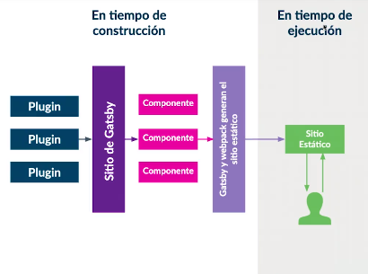

# c-gatsby

# Gatsby

<https://www.gatsbyjs.com/docs/>

Gatsby es un framework open source increíblemente rápido, tanto en desarrollo como en producción. Trabaja con un stack innovador, ya que integra tecnologías como React y GraphQL con diferentes fuentes de información como WordPress o Sanity.io.

Gatsby usa GraphQL para recolectar la información de nuestro sitio web desde diferentes fuentes: APIs, CMS o nuestro sistema de archivos. Y teniendo lista la información, renderiza nuestras vistas en React.js para construir sitios estáticos muy optimizados.

Entre muchas otras aplicaciones, la documentación oficial de React.js está construida con Gatsby: Reactjs.org

# Flujo Gatsby



Funciona como un generador de sitios estaticos donde se apoya sobre plugins para traer informacion o generar funcionalidades y utiliza a React justo con GraphQL para generar las vistas de esta manera cada una de las rutas de nuestros sitio forman un componente, que ams tarde Gatsby con webpack empaquetan para generar un sitio estatico osea por cada vista existe un HTML.

# Diferencias entre SPA, SSR y Gatsby

https://platzi.com/blog/spa-vs-ssr-vs-static-site-generators/
<https://www.youtube.com/watch?v=xC4Yq_mXvPM&feature=youtu.be&ab_channel=Prismic>

- _React en Single Page Applications_

Este tipo de aplicaciones es muy común cuando trabajamos con React.js.

Las SPAs son páginas que siempre cargan el mismo archivo HTML. Este, a su vez, carga un archivo gigante de JavaScript con toda la lógica de nuestra apliacación (por ejemplo, usando React.js).

Estas páginas tienen una carga inicial muy lenta, ya que no podremos ver la información importante hasta que termine de cargar el archivo de JavaScript. Pero una vez termina la carga inicial, las SPAs son muy rápidas, incluso al navegar por diferentes secciones de nuestra aplicación.

Como el archivo de JavaScript tiene todo el código de nuestra aplicación, el tiempo de navegación pasa de segundos a milisegundos. No necesitamos hacer más requests al servidor. Pero en mucho casos debemos esperar algunos segundos para que termine la carga inicial y podamos utilizar la aplicación.

- _React en Server Side Rendering_

Diferentes herramientas como Next.js nos ayudan a utilizar React en el servidor para no afectar el SEO y disminuir el tiempo de carga de nuestra aplicación, todo esto sin perder interactividad.

El Server Side Rendering tradicional es muy común en aplicaciones construidas con WordPress, por ejemplo. Aunque estas páginas tienen un tiempo de carga muy corto, la carga debe repetirse cada vez que el usuario navega por nuestra aplicación, es decir, casi todas las veces que damos click en un link o botón.

Las herramientas de SSR con React.js son muy conscientes de este problema, por lo que convierten nuestra aplicación en una SPA inmediatamente después de que termina la carga inicial. Es decir, utilizan SSR en la primera carga y luego se convierten en SPAs para mejorar la navegación e interactividad de nuestro sitio.

- _React en Gatsby:_

Lo mejor de ambos mundos
Gatsby es un generador de sitios estáticos. Esto quiere decir que en vez de renderizar desde el servidor, lo que sucede cada vez que un usuario entra a nuestra aplicación, Gatsby renderiza el contenido solo una vez en la etapa de desarrollo. Nuestro servidor no debe renderizar todo el tiempo, solo envía el HTML inicial (ya renderizado) para que más adelante el navegador se encargue de cargar el código JavaScript que nos ayudará a que nuestra página funcione como una SPA.

De esta forma obtenemos todos los beneficios: por ser una SPA, seguimos teniendo una alta interactividad y navegación muy rápida, y además, conseguimos una carga inicial muy rápida, en algunos casos incluso superior a la del SSR.

# Gatsby vs. WordPress

Gatsby también nos ayuda a consumir información desde un CMS como WordPress. De esta forma podemos editar nuestro contenido desde una plataforma que ya conocemos sin que esto afecte al rendimiento de nuestra aplicación.

- Gatsby:

  - Utiliza el Virtual DOM (más velocidad)
  - Componentes
  - Hot Reloading
  - Code Splitting e imágenes responsivas

- WordPress:

  - Manejo manual del DOM
  - Debemos copiar y pegar para reutilizar - código (aunque las buenas prácticas nos pueden ayudar bastante)
  - Refresh para ver los cambios

# Gatsby - Garsby CLI y Starters

## Primeros pasos Gatsby

- Dependencias basicas

```
    npm add react gatsby react-dom
```

- Scripts

```
  "scripts": {
    "dev": "gatsby develop"
  },
```

- Folders
  - src
    - pages (index.js)

## Primeros pasos Gatsby-CLI

- Instalamos de manera global

```
sudo npm i -g gatsby-cli
```

- Generamos un proyecto

```
  gatsby new <proyectName>

  gatsby new firstSiteWithGatsbyCLI
```

## Primeros pasos con Starters

Los starters son proyectos creados con el fin de modificar el contenido y tener nuestro sitio listo sin necesidad de hacer configuraciones. Solo debemos copiar el nombre del starter y ejecutar el siguiente comando:

<https://www.gatsbyjs.com/starters/>

Para comenzar a utilizarlos seleccionamos uno de la web y corremos el siguiente comando:

```
  gatsby new <proyectName> <author>/<starterName>

  gatsby new blog gatsby.js/gatsby-starter-blog
```

# ESLint y Gatsby

Gatsby incluye una configuración integrada de ESLint . Para la mayoría de los usuarios, la configuración incorporada de ESLint es todo lo que necesita. Sin embargo, si tienes una configuración personalizada o una convención en tu equipo de trabajo podemos configurarlo.

- Instalación

Ya que Gatsby viene con ESLint configurado de base podemos añadir nuestra configuración inicializando desde la herramienta en node_modules:

```
npx eslint --init
```

Este comando va a lanzar un proceso de ayuda para configurar ESLint paso a paso, revisemos los elementos:

- 1. ¿Con qué objetivo vamos a usar ESLint?

  - En nuestro caso basta con revisar la sintaxis y encontrar problemas.

- 2. ¿Qué tipo de módulos va a utilizar nuestro proyecto?

  - Utilizaremos Javascript modules.

- 3. ¿Qué Framework/Biblioteca va a usar nuestro proyecto?

  - Nuestro proyecto va a utilizar React.

- 4. ¿En qué entorno corre nuestro proyecto?

  -
  - Para nuestro proyecto podemos seleccionar ambas.

- 5. ¿En qué formato deseas el archivo de configuración?
  - Javascript
- 6. Por último, Hace falta una dependencia para trabajar con el estándar de JavaScript, ¿quieres instalarla ahora?
  - Continúa con Y, esto va a instalar una herramienta que nos va a permitir trabajar con React.

El resultado de este proceso es un archivo llamado .eslintrc.js con todas las configuraciones

# Estructura de archivos

- **package.json:** los paquetes, scripts y la configuración principal de cualquier proyecto con Node.js.
- **gatsby-config.js:** configuramos la metadata (título, descripción y autor) y los plugins de Gatsby que usaremos para construir nuestra aplicación.

- **gatsby-browser.js:** una parte de nuestro código se construye desde el servidor, en el build time, y otra parte muy importante en el navegador, cada vez que los usuarios entran a nuestra aplicación. En este archivo podemos utilizar algunas APIs o métodos predefinidos para configurar el código que debe ejecutarse en el navegador, por ejemplo, para añadir vistas, cargar librerías o configurar un store global para manejar el estado.
  - Ejecuta cuando mi proyecto esta ya del lado del cliente por ejemplo cargar google maps. **Lo importante es que todo esto ocurre despues del render de la app**
- **gatsby-node.js**: configuramos todo lo que tiene que ver con la construcción de nuestro sitio web con Gatsby. Podemos generar vistas en función de nuestra información proveniente de GraphQL, incluso utilizando APIs externas a nuestra aplicación.
  - Aqui puede tomar info de graphql y generar vistas con esa info
- **gatsby-ssr.js:** configuramos lo que sucede en el build time para que nuestra aplicación funcione correctamente en producción. Tiene el mismo fin que gatsby-browser.js, solo que este será el código que enviamos a producción.
  El resto de archivos y carpetas contienen código JavaScript (seguramente con React) y CSS.
  # Plugins

Piezas de codigo que podemos agregar a nuestro proyecto. Los plugins pueden ayudarnos de 3 formas:

- **Plugins como Componentes:** (plugin componente) Cuando instalamos el plugin obtenemos un componente que debemos integrar a nuestra aplicación para obtener algún beneficio/ resolver alguna problematica.

  - Por ejemplo gatsby-rect-helmet

- **Plugins como Funcionalidades:** ( plugin funcional) Nos ayudan a transformar información o implementar una funcionalidad en concreto.
- Por ejemplo: gatsby-image nos ayuda a crear nuevas versiones de nuestras imágenes con menor calidad para mejorar la carga inicial de nuestro sitio web.

- **Plugins como Fuente de Datos:** (plugin fuentes de datos) Estos plugins utilizan Node.js y GraphQL para consumir la información de algún lugar o herramienta como Firebase, WordPress, APIs Rest, entre otras.
  - Por ejemplo gatsby-source-filesystem: nos ayuda a tomar lo que esta en "cierta carpeta" y ponerlo disponible en graphql
